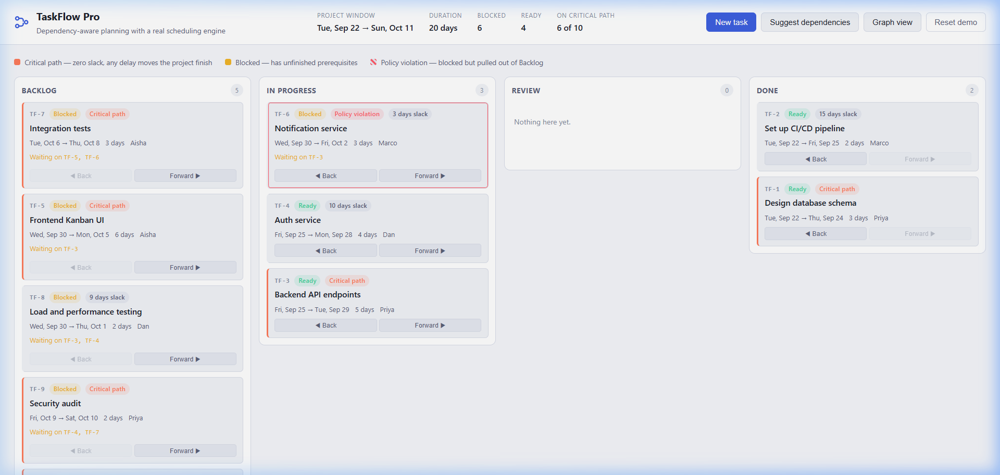
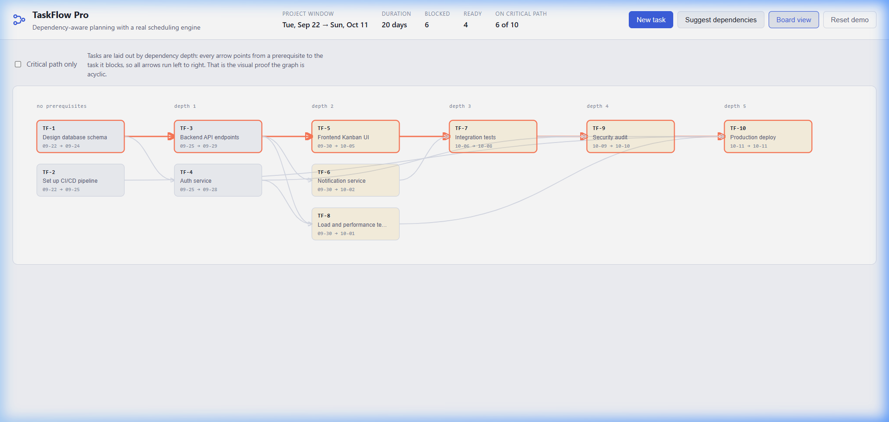
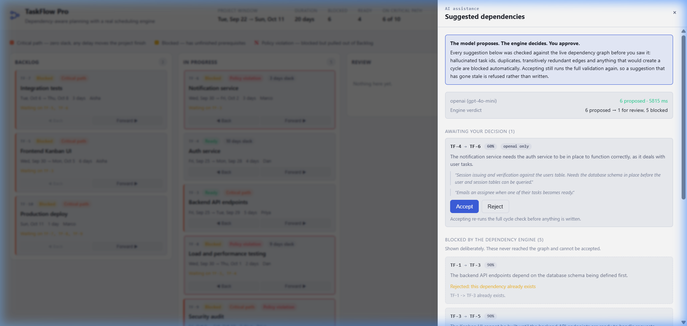
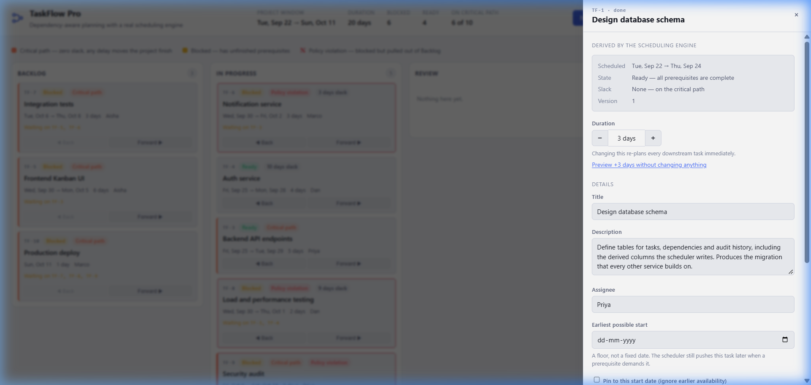

# TaskFlow Pro

A Kanban board with a real scheduling engine underneath it.

Tasks declare prerequisites. The engine keeps the dependency graph acyclic,
computes every task's dates by critical-path method, marks what is blocked and
by what, reports slack, and highlights the critical path. Change one duration
and every downstream date moves — by the correct amount, not by a naive sum.
Two AI providers suggest dependencies you might have missed, and the engine
overrules them when they are wrong.

**The central claim, stated plainly:** *the AI proposes, the engine disposes,
and a human approves.* Nothing a model says reaches the graph without passing
seven deterministic checks and then a person clicking Accept.



---

## 60-second quickstart

Requires **Node 24+** (for native TypeScript and `node:sqlite`). Nothing else.

```bash
git clone https://github.com/Eykagra/HACK-2026-101891.git && cd taskflow-pro
npm install          # only devDependencies: typescript and @types/node
npm start            # seeds a demo board on first boot
```

Open <http://localhost:8080> (or <http://localhost> with Docker). There is no build step and no API key required —
suggestions fall back to a deterministic offline provider.

With Docker instead:

```bash
docker compose up -d      # app + Caddy reverse proxy
```

---

## Interface Overview

| Kanban Board & Live Critical Path | DAG Dependency Graph View |
| :---: | :---: |
|  |  |

| AI Dependency Proposals & Engine Gates | Task Detail & What-If Impact Drawer |
| :---: | :---: |
|  |  |

---

### Try the parts that matter

| To see | Do this | What should happen |
| --- | --- | --- |
| **Cycle rejection** | Open TF-1, add TF-10 as a prerequisite | Refused with the exact loop `TF-1 → TF-3 → TF-8 → TF-10 → TF-1`. No date moves. |
| **Correct propagation** | Open TF-3, press **+** three times | 7 tasks move, project finish slips exactly **3** days — not 6, even though two parallel paths run through the diamond. |
| **Slack is real** | Open TF-6 (5 days slack), press **+** once | Nothing downstream moves. Its float absorbed the change. |
| **Non-destructive what-if** | Open any task → *Preview +3 days* | A full impact narrative, computed by the real scheduler, with nothing written. |
| **AI under supervision** | Click **Suggest dependencies** | ~12 proposals, most blocked with reasons — hallucinated ids, cycles, redundant edges — and the survivors queued for approval. |
| **The DAG** | Click **Graph view** | Left-to-right layered layout. Every arrow points right; that is the visual proof the graph is acyclic. |

---

## What is actually hard here

Most Kanban clones store a start date and an end date on each task. That
breaks the moment tasks depend on each other, because the dates are no longer
independent facts — they are consequences.

Three specific traps, and what this project does about them:

**1. Dates are derived, not stored.** `duration_days` is the input; start and
end are outputs of a scheduling pass. Storing both an editable start date and a
dependency graph guarantees they will disagree. The UI reflects this: editable
fields and engine-derived facts are visually separated, and the derived block is
labelled as such.

**2. Propagation is a recompute, not a delta.** The intuitive implementation —
"push each successor forward by the same N days" — is wrong on a diamond. If
`A → {B, C} → D` and A slips 3 days, D must move 3, not 6. It is also wrong
whenever a successor has slack. This engine re-solves the whole graph on every
change: `O(V + E)`, single-digit milliseconds at 10,000 tasks (there is a
[perf test](test/engine.property.test.ts) that asserts this), and impossible to
get subtly wrong. [ADR 0002](docs/adr/0002-recompute-over-delta.md) has the
numbers.

**3. Cycle prevention must be atomic.** Validating and then writing in two steps
loses a race: submit `A → B` and `B → A` simultaneously and both pass
validation against the graph as each request read it. Every graph mutation runs
inside a `BEGIN IMMEDIATE` transaction, which takes the write lock *before*
reading, so the second request validates against the first one's result and is
correctly refused. [There is a test that fires both with
`Promise.all`](test/api.test.ts) and asserts exactly one wins.

---

## Architecture in one picture

```
          browser (no framework, no bundler, ES modules)
                            │  fetch /api/*
┌───────────────────────────▼─────────────────────────────────┐
│  http/          routing · problem+json · rate limit · CSP   │
├─────────────────────────────────────────────────────────────┤
│  services/      transactions · audit · policy · provenance  │
├─────────────────────────────────────────────────────────────┤
│  engine/        PURE. topo sort · CPM · slack · diff        │  ← zero imports
├─────────────────────────────────────────────────────────────┤
│  db/            Repository · schema.sql · SQLite (WAL)      │
└─────────────────────────────────────────────────────────────┘
        ai/  providers → 7 gates → human approval → services
```

`src/engine/` imports nothing — not the database, not the config, not even
`node:*`. It is a pure function from graph to schedule. That is what makes it
testable as a unit, provable by property tests, and reusable in the browser
for a preview if that ever becomes worthwhile.

Full detail, including the data model and known limitations, is in
**[docs/DESIGN.md](docs/DESIGN.md)**.

---

## How the AI is kept on a leash

Two providers (OpenAI and Gemini) are asked the same question **in parallel**.
An edge both models propose independently is a stronger signal than one either
produces alone, so agreement is shown to the reviewer rather than averaged away.

Every raw suggestion then passes seven deterministic gates:

| # | Gate | Catches |
| --- | --- | --- |
| 1 | Schema parse | malformed or partial JSON |
| 2 | Task-id allowlist | hallucinated task keys — models invent `TF-99` |
| 3 | Verbatim evidence | fabricated justifications; the quoted span must appear in the task's own text |
| 4 | Duplicate / self-edge | re-proposing what exists |
| 5 | Cycle check *(the engine)* | circular dependencies, including pairs that are only circular together |
| 6 | Prior human rejection | re-proposing what a reviewer already declined |
| 7 | Confidence floor + cap | low-quality noise, unbounded review queues |

Rejections are **shown, not hidden** — with the reason, including the exact
cycle path. Watching the engine overrule the model is the clearest available
demonstration of where authority sits.

### Impact narratives never contain a model's arithmetic

The scheduler computes the numbers; the model only turns an already-correct
structured diff into a sentence. Generated prose is then **verified**: every
integer and date in it must appear in an allowlist derived from the diff. If a
model writes "slipped 6 days" when the engine said 3, the text is discarded and
a deterministic template is used instead. A confident wrong number in a planning
tool is worse than a plain right one.

### Measured, not asserted

`npm run ai:eval` hides four known-true dependencies, asks each provider to
recover them, and scores precision, recall and F1 *after* gating — so what is
measured is what a user would actually be shown. The offline heuristic is
included as a floor, because "0.8 precision" means nothing until you know what
keyword matching scores on the same fixture.

```
provider                      raw  gated     TP     FP   prec recall     F1
heuristic                      12      8      1      7   0.13   0.25   0.17
```

Run it with keys set to fill in the model rows. The harness is in
[`scripts/ai-eval.ts`](scripts/ai-eval.ts) and runs in CI without a key.

---

## Testing

```bash
npm test            # 120 tests
npm run test:engine # pure scheduling logic
npm run test:api    # real HTTP + real SQLite integration
npm run test:ai     # gates, consensus, narrative grounding
npm run typecheck
```

The suite is written around invariants rather than snapshots. Highlights:

- **Property tests** over randomly generated DAGs (seeded, reproducible):
  every task starts at or after all prerequisites finish; the critical path
  always has zero slack; path count never affects the answer.
- **The diamond test** — the case a delta-propagation implementation fails.
- **Concurrency** — two inverse dependencies submitted with `Promise.all`;
  exactly one may win.
- **Rollback** — a rejected write must leave the board *byte-identical*,
  asserted field by field.
- **Restart** — close the server, reopen the same file, assert every derived
  date matches what was served before.

Three real bugs were found by these tests during development and are documented
in [docs/KNOWN-ISSUES.md](docs/KNOWN-ISSUES.md): a stack overflow from recursive
DFS at 10k nodes, non-deterministic critical-edge output caused by inherited
input ordering, and a completed task rendering an end date before its start.

---

## Key assumptions

These are decisions, not oversights. Each one is a place a reviewer might
reasonably expect something else.

1. **Calendar days, not working days.** No weekend or holiday logic. Real
   projects need it; adding it correctly needs a locale and a holiday calendar,
   and faking it would be worse than omitting it. The engine works in integer
   epoch days, so a `isWorkingDay` predicate is a contained change.
2. **Finish-to-start dependencies only.** The `lag_days` column supports a
   delay, but start-to-start and finish-to-finish are not modelled.
3. **Durations are certain.** No estimate ranges, no probabilistic scheduling.
4. **A task is available as early as its prerequisites allow.** Resource
   levelling — the same person being on two parallel tasks — is not modelled.
   `assignee` is a label, not a constraint.
5. **Single board, no authentication.** The scope is a dependency engine, not a
   multi-tenant SaaS. `board_id` is on every table and every query is scoped by
   it, so the seam exists; the auth layer does not.
6. **A blocked task may leave Backlog, with a visible warning.** Blocking the
   move would be over-reach: sometimes you genuinely start work early.
   Configurable to `block` per board.
7. **Dates are stored and computed in UTC.** No per-user timezone.

---

## Limitations

Stated bluntly, because pretending otherwise is worse:

- **Single-instance only.** SQLite plus an in-memory rate limiter means one
  process. [ADR 0001](docs/adr/0001-sqlite-over-postgres.md) explains why that
  is the right trade for this scope and exactly what changes for Postgres —
  the `Repository` class is the only file that touches SQL.
- **Full recompute on every write.** Fine to roughly 10k tasks. Beyond that,
  recomputing only the affected subgraph is the documented next step; the
  current approach was chosen for correctness, and the trade-off is measured
  rather than assumed.
- **No undo.** Every change is in the audit log with its full diff, so the
  data to implement it exists, but the reverse-application code does not.
- **No realtime sync.** Two open tabs do not push to each other. Optimistic
  version checks mean the second writer gets a clear 409 instead of silently
  clobbering, which is the important half.
- **The AI evaluation set is small** — 10 tasks, 4 hidden edges. It detects
  gross regressions, not fine differences between models.
- **Accessibility is good, not audited.** Keyboard operable throughout, ARIA
  live regions for every schedule change, non-colour channels for all state,
  visible focus. Not checked against WCAG 2.2 AA with a real screen reader.

---

## Documentation map

| Document | What is in it |
| --- | --- |
| [docs/DESIGN.md](docs/DESIGN.md) | Architecture, data model, scheduling algorithm, known limitations |
| [docs/adr/](docs/adr/) | Six decision records, each with the alternatives that were rejected and why |
| [docs/API.md](docs/API.md) | Every endpoint, with example requests and error shapes |
| [docs/TEST-PLAN.md](docs/TEST-PLAN.md) | What is tested, what is deliberately not, and why |
| [docs/TRACEABILITY.md](docs/TRACEABILITY.md) | Each stated requirement → the code and the test that satisfy it |
| [docs/KNOWN-ISSUES.md](docs/KNOWN-ISSUES.md) | Open issues, and the three bugs the tests caught |
| [docs/DEMO.md](docs/DEMO.md) | Five-minute demo script |
| [docs/DEPLOY.md](docs/DEPLOY.md) | EC2 deployment, secrets, backup, rollback |
| [AI-TOOL-DECLARATION.md](AI-TOOL-DECLARATION.md) | Which AI tools were used to build this, and how |

---

## Project layout

```
src/
  engine/       pure scheduling: topo sort, CPM, slack, diff, fractional rank
  db/           schema.sql + Repository (the only file with SQL in it)
  services/     transactional use cases: tasks, dependencies, suggestions
  ai/           providers, prompts, seven gates, consensus, narrative
  http/         node:http server, routes, RFC 9457 problem details
  config.ts     validated at boot; the process refuses to start on a bad value
  seed.ts       the 10-task demo scenario, chosen to exercise every edge case
web/            no bundler: index.html, styles.css, 9 ES modules
test/           120 tests
docs/           design, ADRs, API, test plan, traceability, demo script
```

## License

[MIT](LICENSE).
